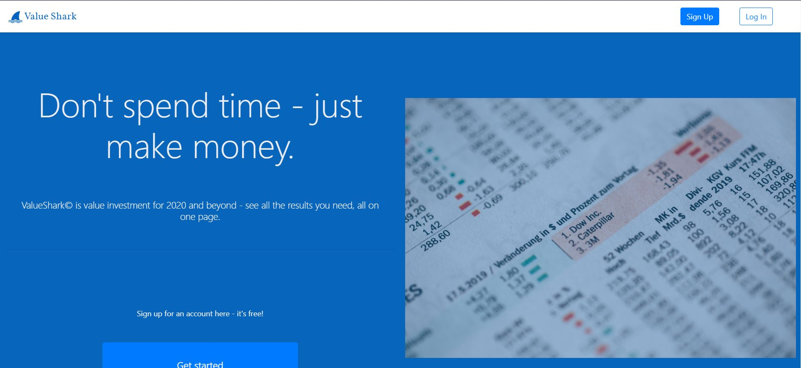

# Value Shark
A web application for value investors to quickly identify potential opportunities and track their portfolio.

## Team members:
* Chase Tucker
* Ashlyn Morin
* Lucas Wilber
* Vik Akam
* Ran Vaknin

## What is Value Shark?
Value Shark is a tool that decreases the time spent on searching for an investment and helps to organize and track investments all in one, convenient and free app.

## Scope
IN - Users will be able to sign up for an account with the app. After signing in, the user can start a portfolio by searching for companies. Upon company search, the user can view company details and choose to add the company to their portfolio. 
Users can use the portfolio to track stocks they already own by filling in the form at the bottom of each company page. This form allows them to track the number of shares they own and the price they paid for said shares so they can then compare them to the current stats on those investments. Users can also add stocks they want to watch for possible investment and can delete companies from their portfolio as well. 
On the home page, users will see a Prospects table which lists detailed information on a list of possible value investment companies that the IEX Cloud API sorts based on the company stats.

OUT - This app will not allow for stock purchasing and it will not do analysis of other types of investments. 

## Technologies Used:
* API: iexcloud.io
* Bootstrap
* Spring MVC
* Postman
* IntelliJ
* bCrypt
* PostgreSQL
* Amazon AWS
* Thymeleaf
* Gradle
* JQuery

## How to Use:
1. Clone the repository on your local environment.
2. Ensure you have a PostgreSQL database dedicated for this application.
3. Obtain an API key from [iexcloud.io](iexcloud.io)
4. Create environment variables for DATABASE_URL, DATABASE_USERNAME, DATABASE_PASSWORD, and an IEXCLOUD_PUSHABLETOKEN which uses your iexcloud API key.
5. Run the application using the ./gradlew bootRun command in your terminal.

## ValueShark app:
### Visit [valueshark.io](valueshark.io).

